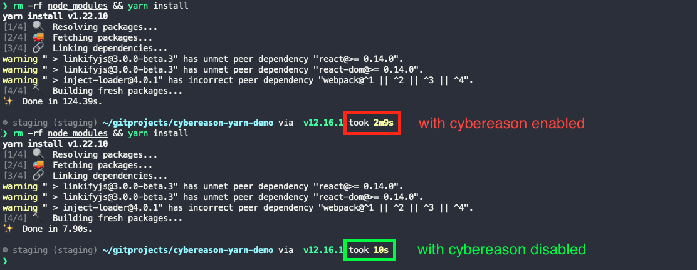

# Cybereason Yarn Demo

> Cybereason is making yarn commands run slowly. This demo sets up a small set of steps to help reproduce the problem.

## Setup

1. [Download and Install node](https://nodejs.org/en/download/) on your machine. You might already have node installed...a quick way to check is to run `node --version` in the terminal.

> :bulb: This problem has been demonstrated with node versions `8`, `12` and `14`.

2. [Install yarn](https://classic.yarnpkg.com/en/docs/install).

> :bulb: This problem was last reproduced using yarn version `1.22.10`, but older versions of yarn were also capable of reproducing the problem

3. Now open your terminal and change to the same directory as this readme. For example:

```
$ cd ~/Downloads/cybereason-yarn-demo
```

4. Lastly, make sure that Cybereason is running on your machine.

## Reproduce the Problem

Now that you have Node and Yarn installed, and your terminal is open to this directory, you are ready to reproduce the problem.

Simply run this command that will remove the node_modules directory (if it exists). This will ensure that there are no dependencies installed locally, so that the yarn installation must do all the hard work to install them (which is where the cybereason interference is the most obvious):

```
$ rm -rf node_modules
```

Now install the dependencies with yarn:

```
$ yarn install
```

At this point, the download of the yarn dependencies and the subsequent linking of the dependencies will be very slow while cybereason is enabled. Disabling Cybereason, you will notice that the yarn installation is normally very fast. 

## Proof

As proof, here is a comparison of the yarn installation on MacBook Pro (15-inch, 2018) with a 2.2 GHz 6-Core Intel Core i7

- With Cybereason **enabled**: `yarn install` took `2m9s`
- With Cybereason **disabled**: `yarn install` took `10s`



> **Note** we have had times where `yarn install` takes up 14-30 minutes to complete for projects that normally only take <20s to install.


## Related Info

- We were not able to reproduce this problem on Linux (tested on `5.4.0-74-generic "Linux Mint 20.1 Ulyssa"`). With Cybereason **enabled**, the yarn install took `0m8.051s`


